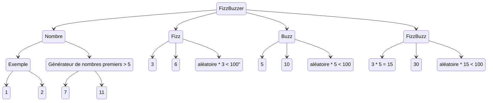

Ce kata FizzBuzz est le plus court des katas classique.

On s'en sert beaucoup pour faire une démo des trois lois de TDD (red, green, refactor).

Le sujet : Comme les enfants américains de primaire, nous allons compter de 1 à 100 sauf que l'on devra dire fizz pour tous les multiples de 3 et buzz pour tous les multiples de 5.
Le kata demande donc une boucle de 0 à 100, les démos se limitent souvent aux règles de gestions qui prennent un entier en argument et retourne le nombre, fizz ou buzz.

Comme tout développement en TDD, on commence par un test qui ne compile pas, car il appelle un code qui n'existe pas.
On commence par le test le plus simple possible.
Un appel sans cas particulier, simple "qui va tout droit".
L'objectif ici est d'avoir une fonction/méthode/api appelable.

Le cas de tests proposé est souvent de voir un fizz quand on envoie 3.
Sauf qu'il y a encore plus simple, avec *moins de règles de gestions impliquées* : on envoie 1 et on retourne "1".

Pour écrire un test sans code de prod, on commence par décrire notre objectif, le résultat que l'on attends sous forme d'assertion.
Ensuite, on appelle la fonction qui prends souvent arguments et qui a besoin d'un contexte initial (base de données en mémoire).
Nos tests sont des expérimentations (vouées à fonctionner) et pour en réduire le coût, on se focus sur l'objectif.
On utilise le même raisonnement de "Commencer par finir" que l'on trouve dans la mise au point de process en Kanban ou dans la réduction de coût d'une expérimentation

Si on cherche des exemples, on trouve :

