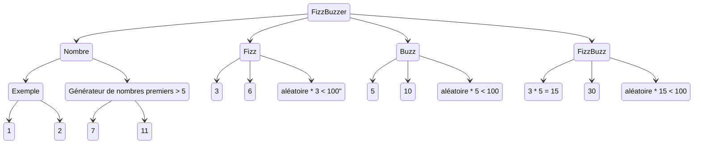

Ce kata FizzBuzz est le plus court des katas classique.

On s'en sert beaucoup pour faire une démo des trois lois de TDD (red, green, refactor).

Le sujet : Comme les enfants américains de primaire, nous allons compter de 1 à 100 sauf que l'on devra dire fizz pour tous les multiples de 3 et buzz pour tous les multiples de 5.
Le kata demande donc une boucle de 0 à 100, les démos se limitent souvent aux règles de gestions qui prennent un entier en argument et retourne le nombre, fizz ou buzz.

Comme tout développement en TDD, on commence par un test qui ne compile pas, car il appelle un code qui n'existe pas.
On commence par le test le plus simple possible.
Un appel sans cas particulier, simple "qui va tout droit".
L'objectif ici est d'avoir une fonction/méthode/api appelable.

Le cas de tests proposé est souvent de voir un fizz quand on envoie 3.
Sauf qu'il y a encore plus simple, avec *moins de règles de gestions impliquées* : on envoie 1 et on retourne "1".

Comme pour réduire le coût des expérimentations, on se focus sur le résultat à atteindre et on "Commence par finir".
On commence par décrire notre objectif, le résultat que l'on attends sous forme d'assertion.
Ensuite, on appelle la fonction qui prends souvent des arguments et qui finalement a besoin d'initialisation.
Les tests ont souvent un structure de machine à état (Given, When, Then).
```
Etant donné un état initial
Quand j'appelle mon système
Alors je vérifie l'état final
```
Cette démarche d'écriture de test à l'envers aide à lutter contre la feuille blanche. 
Pour commencer à coder, le strict minimum a savoir est la cible à atteindre donc l'état final, on remonte ensuite le fil.
Pour obtenir cet état, il faut appeler une fonction.
Pour que cette fonction puisse faire le travail, elle a besoin d'informations : une demande et parfois une configuration/initialisation.

Vous aurez souvent une idée claire de la fonction a appeler et de ses besoins d'initialisation, donc vous écrirez souvent les tests dans l'ordre où on les lis.

Nous venons de finir de mettre au point un test non passant.
Il est temps de créer la fonction pour que le code compile et de l'implémenter pour que le test soit passant.

Coté code de production, l'implémentation doit être la plus simple possible, donc bête et naïve.
Donc on retourne "1" et pas un nombre converti en texte.
Cela donne un test passant et un code de production le plus simple possible, donc le plus facile à maintenir.

C'est bien en phase de refactor que l'on va être de bonne foi pour transformer la réponse directe et naïve en une réponse qui fonctionnera pour toutes les entrées valides possibles.
Il peut être utile de faire un second cas de test sur le même aspect d'une fonctionnalité pour "trianguler" une solution.
On se retrouve alors avec une duplication explicite au lieu d'être imaginaire : si cas 1, alors on traite un retour x sinon si cas 2, alors on traite un retour qui ressemble à x.
Cette duplication délibérée aide a factoriser ce qui est vraiment commun sans l'imaginer.

Après avoir testé le cas nominal le plus simple et implémenté cette "balle traçante", il reste a construire les autres aspect de la fonctionnalité autour.
En kata, on se limite aux cas attendus et explicites.
En projet, j'ai tendance a continuer avec la validation des arguments, le code défensif, tout ce qui me permet d'échouer rapidement.
C'est pas le plus fun, par contre, le reste de l'algorithme ne raisonnera que sur des données valides et ça réduit agréablement la charge cognitive.
Ce code défensif ce fait souvent à l'entrée des APIs et pas dans les règles de gestion de la couche métier.
On pourrait écrire un test qui envoie un nombre négatif ou au-dessus de 100.

Passons à un 2e tests, on vérifie 2 ou on test un premier fizz ?
La réponse va dépendre de votre niveau de confiance dans les tests existant pour documenter votre fonctionnalité et dans le code de prod pour être conforme au besoin.
Pour se donner confiance, on peut multiplier les exemples, mais d'un point de vue documentation, les tests sont des doublons. Une autre façon de faire est d'utiliser un générateur de données d'antrées et de vérifier que le résultat reste constant

Si on cherche des exemples, on trouve :



