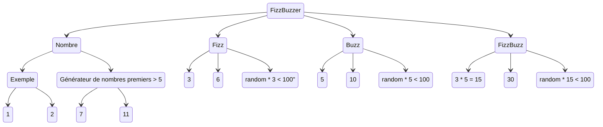

Ce kata FizzBuzz est le plus court des katas classique.

On s'en sert beaucoup pour faire une démo des trois lois de TDD (red, green, refactor).

Le sujet : Comme les enfants américains de primaire, nous allons compter de 1 à 100 sauf que l'on devra dire fizz pour tous les multiples de 3 et buzz pour tous les multiples de 5.
Le kata demande donc une boucle de 0 à 100, les démos se limitent souvent aux règles de gestions qui prennent un entier en argument et retourne le nombre, fizz ou buzz.

Si on cherche des exemples, on trouve :



```mermaid
mindmap

	root(FizzBuzzer)
		Non multiple
			exemples
				1 retourne "1"
				2 retourne "2"
			Propriétés
				générateur de nombres premiers compris entre 5 exclu et 100 inclu (7, 11) retourne le nombre en texte
		Fizz
			exemples
				3 retourne Fizz
				6 retourne Fizz
			propriétés
				générateur de nombres entre 1 et (100/3)=33, multiplié par 3 (et inférieur à 100) retourne Fizz
		Buzz
			exemples
				5 retourne Buzz
				10 retourne Buzz
			propriétés
				générateur de nombres entre 1 et (100/5)=20, multiplié par 5 (et inférieur à 100) retourne Buzz
		FizzBuzz
			exemples
				3*5=15 retourne FizzBuzz
				15*2=30 retourne FizzBuzz
			propriétés
				générateur de nombres entre 1 et (100/15)=6 ou 7, multiplié par 15 (et inférieur à 100) retourne Buzz

```

