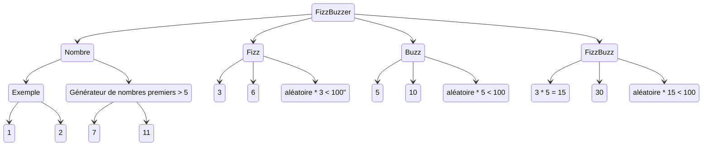

Ce kata FizzBuzz est le plus court des katas classique.

On s'en sert beaucoup pour faire une démo des trois lois de TDD (red, green, refactor).

Le sujet : Comme les enfants américains de primaire, nous allons compter de 1 à 100 sauf que l'on devra dire fizz pour tous les multiples de 3 et buzz pour tous les multiples de 5.
Le kata demande donc une boucle de 0 à 100, les démos se limitent souvent aux règles de gestions qui prennent un entier en argument et retourne le nombre, fizz ou buzz.

Comme tout développement en TDD, on commence par un test qui ne compile pas, car il appelle un code qui n'existe pas.
On commence par le test le plus simple possible.
Un appel sans cas particulier, simple "qui va tout droit".
L'objectif ici est d'avoir une fonction/méthode/api appelable.

Le cas de tests proposé est souvent de voir un fizz quand on envoie 3.
Sauf qu'il y a encore plus simple, avec *moins de règles de gestions impliquées* : on envoie 1 et on retourne "1".

Comme pour réduire le coût des expérimentations, on se focus sur le résultat à atteindre et on "Commence par finir".
On commence par décrire notre objectif, le résultat que l'on attends sous forme d'assertion.
Ensuite, on appelle la fonction qui prends souvent des arguments et qui finalement a besoin d'initialisation.
Les tests ont souvent un structure de machine à état (Given, When, Then).
```
Etant donné un état initial
Quand j'appelle mon système
Alors je vérifie l'état final
```
Cette démarche d'écriture de test à l'envers aide à lutter contre la feuille blanche. 
Pour commencer à coder, le strict minimum a savoir est la cible à atteindre donc l'état final, on remonte ensuite le fil.
Pour obtenir cet état, il faut appeler une fonction.
Pour que cette fonction puisse faire le travail, elle a besoin d'informations : une demande et parfois une configuration/initialisation.

Vous aurez souvent une idée claire de la fonction a appeller 

Si on cherche des exemples, on trouve :



