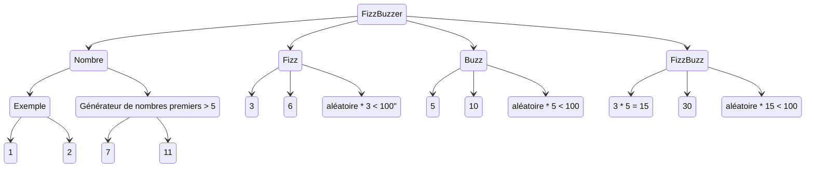

Ce kata FizzBuzz est le plus court des katas classique.

On s'en sert beaucoup pour faire une démo des trois lois de TDD (red, green, refactor).

Le sujet : Comme les enfants américains de primaire, nous allons compter de 1 à 100 sauf que l'on devra dire fizz pour tous les multiples de 3 et buzz pour tous les multiples de 5.
Le kata demande donc une boucle de 0 à 100, les démos se limitent souvent aux règles de gestions qui prennent un entier en argument et retourne le nombre, fizz ou buzz.

Comme tout développement en TDD, on commence par un test qui ne compile pas, car il appelle un code qui n'existe pas.

Pour écrire un test sans code de prod, on commence par décrire notre objectif, le résultat que l'on attends sous forme d'assertion

Si on cherche des exemples, on trouve :

